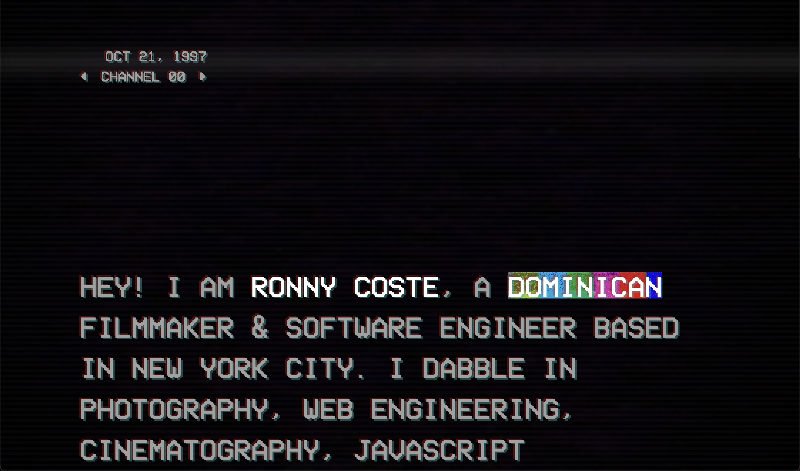

# Experience Cinema

This repo host a experiencial way of looking at the films that I have worked on in a way that it is more tailored and memorable. 
Also this is a reverse Engineer of another website that inspire me to do this.  
Nice to make your acquaintance 😁. 

## Technical considerations

**Why use this over SvelteKit?**

- It brings its own routing solution which might not be preferable for some users.
- It is first and foremost a framework that just happens to use Vite under the hood, not a Vite app.
  `vite dev` and `vite build` wouldn't work in a SvelteKit environment, for example.

This template contains as little as possible to get started with Vite + Svelte, while taking into account the developer experience with regards to HMR and intellisense. It demonstrates capabilities on par with the other `create-vite` templates and is a good starting point for beginners dipping their toes into a Vite + Svelte project.

Should you later need the extended capabilities and extensibility provided by SvelteKit, the template has been structured similarly to SvelteKit so that it is easy to migrate.

###Useful command for transcoding and downloading the videos

* ffmpeg -i channel-08.mp4 -c:v libvpx-vp9 -crf 30 -b:v 0 -b:a 128k -c:a libopus channel-08.webm

* yt-dlp -f mp4 (Link Goes Here)

yt-dlp does not support webm

**This website was inspired by [kaisermann](https://kaisermann.me)**

[License](/license)
